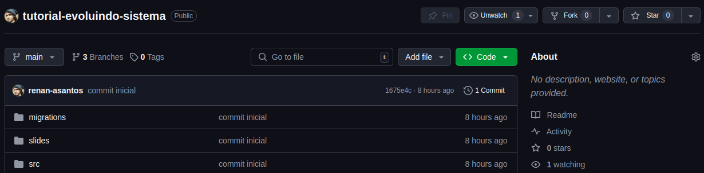

<!-- paginate: false -->
<style scoped>
h1 {text-align:center; margin-top:120px;}
h3 {text-align:center}
</style>

# Evoluindo o sistema
### Renan de Assis
### Ana Dulce

---
# Quem é o Renan?

- Bacharel em Física


---
# Quem é o Renan?

- Bacharel em Física
- Trabalho com engenharia de software no Serasa


---
# Quem é o Renan?

- Bacharel em Física
- Trabalho com engenharia de software no Serasa
- Gosto de vôlei, jogos de tabuleiro e tenho uma tatuagem do desenho Avatar
* Ajudo na organização de eventos Python Brasil


---
# Quem é a Ana?

- Desenvolvedora Python desde 2018 - atualmente engenheira de software no KaBuM!;
- Cofundadora do PyLadies São Carlos;
- Organizadora de eventos da comunidade Python no tempo livre;
- Atual Conselheira e ex-presidente da Associação Python Brasil;
- Python Fellow Member;

---

# Motivação

- Diversas oficinas e cursos de "crie sua primeira API"
* O sistema ficou pronto, mas e agora? (imagem de swagger fastapi pronto)

<!--
- Sempre vi tutoriais de criar a primeira API com algum framework, 
seja com flask, django ou fastapi.
- É bem legal saber fazer isso mesmo, é a parte principal para nosso sistema
estar minimamente funcional, mas um projeto de software não acaba aí.
-->
---

# Motivação

- Existem muitos outros recursos "ao redor" da API para melhorar nosso sistema
  - Qualidade
  - Confiabilidade
  - Observabilidade
  - Facilidade de manutenção

<!--
Existem muitos outros recursos para adicionarmos para melhorar a qualidade, confiabilidade e capacidade de manutenção do nosso projeto.
Isso que vamos fazer juntos no dia de hoje
-->
---

# Alinhamentos iniciais

* Contexto aplicações web
* Não levem como verdade absoluta
* O que essa oficina **não** vai abordar?
  - Como **criar** uma API com nenhum framework de Python
  - Funcionamento detalhado de uma API

<!--
Primeiro de tudo queríamos deixar claro alguns alinhamentos iniciais:
- aplicações web (mas algumas coisas podem ser usadas fora)
- não é verdade absoluta, vamos apresentar uma forma de fazer, existem muitas outras
- o que essa oficina não vai abordar
  - como criar api: como dito, queremos saber o que ocorre DEPOIS de criada a API
  - Detalhes de como funciona uma API
-->
---

# O que essa oficina vai te mostrar?

<div class="columns">
<div>

1) configuração do ambiente
2) documentação
3) logs
4) testes

</div>
<div>

5) formatadores
6) análise estática
7) automação de comandos
8) automação com git hooks

</div>
</div>

<!--
configurar o ambiente com um sistema já existente
-->

---
<style scoped>
h1 {font-size: 100px; text-align:center;margin-top:200px;}
</style>

# BORA TIMEE

---

# Em que passo estamos?

<div class="columns">
<div>

1. <span style="color:black">configuração do ambiente</span>
2. documentação
3. logs
4. testes

</div>
<div>

5. formatadores
6. análise estática
7. automação de comandos
8. automação com git hooks

</div>
</div>

---

# Precisamos de um projeto para evoluir...

https://github.com/renan-asantos/tutorial-evoluindo-sistema



<!--
- Para essa oficina vamos usar a base do projeto que foi feito ontem na oficina de FastAPI da Ana Dulce
-->

---

# Configuração do ambiente

- Ambiente Unix-like
- Clonar projeto
- Versão do python
- Gerenciador de dependências
- Ambiente virtual ativo
- Rodar o projeto

---

# Vamos usar o replit.com


---

# Configuração replit

- Acessar https://replit.com
- Fazer o login (ou criar uma nova conta no "**Start Building**")


---

# Configuração replit

- "Create repl" >> "Import from Github" >> "From URL"


(lembrar de alterar arquivo .replit)

---

# Ambiente Unix-like

- Sistema operacional que se comporta similarmente ao system Unix (lançado em 1971)
- Exemplos:
  - Linux e suas distribuições (Ubuntu, Debian, Fedora, etc)
  - MacOS (Darwin)
  - Android (baseado em Linux)
  - iOS (baseado no Darwin)

---

# Versão do python


<!-- _footer: https://devguide.python.org/versions/ -->
---

# Versão do python - Pyenv


---

# Gerenciador de dependências

- Um sistema pode ser composto de código nosso e também de outras pessoas
- Geralmente precisamos instalar bibliotecas (dependências) para fazer um projeto maior
- Precisamos de uma ferramenta para auxiliar nessa tarefa
- Exemplos: Pip, pipenv, poetry, uv

<!--
Pip é o instalador de dependências padrão do Python
Pipenv é da Python Packaging Authority (Pypa) 
Poetry tem o lema "Python packaging and dependency management made easy", é uma ferramenta muito conhecida na comunidade
uv é uma ferramenta lançada esse ano e está em constante desenvolvimento
-->

---

# Poetry


---

# Instalar dependências


---

# Rodando o projeto

- Configurar o banco
```
alembic upgrade head
alembic revision --autogenerate -m "mensagem de criação"
```
- Rodar o projeto
```
fastapi dev src/app.py
```

AVISAR SOBRE LIMITE REPLIT

---

# Rodando o projeto

- Acessar /docs, ver o swagger e chamar um dos endpoints com sucesso (cadastrar um filme e um genero e retornar eles)


<!--
- então é isso, já ta pronto e funcional, fazendo sua atividade fim
- agora vamos melhorar as "bordas" dele
-->

---

# Em que passo estamos?

<div class="columns">
<div>

1. ~~configuração do ambiente~~
2. <span style="color:black">documentação</span>
3. logs
4. testes

</div>
<div>

5. formatadores
6. análise estática
7. automação de comandos
8. automação com git hooks

</div>
</div>

---

# Documentação

- Quando não sabemos algo de algum projeto ou biblioteca vamos na documentação dela
  - fastapi, django, requests...
- Criar documentações é uma forma de repassar conhecimento
- A boa formatação da documentação ajuda nesse repasse

<!--
Muito mais para bibliotecas do que sistemas web
mas é um bom conhecimento para dizer que já fez um dia
-->

---

# Documentação


---

# Documentação


---

# Documentação

- Entendimento do sistema
- Criação de uma documentação simples

---

# Em que passo estamos?

<div class="columns">
<div>

1. ~~configuração do ambiente~~
2. ~~documentação~~
3. <span style="color:black">logs</span>
4. testes

</div>
<div>

5. formatadores
6. análise estática
7. automação de comandos
8. automação com git hooks

</div>
</div>

---
<style scoped>
img {margin-top: 30px}
</style>

# Logs

- O que são? Onde vivem? Como se alimentam?
* Não tem nada a ver com logaritmo


---
# Logs

>> Expressão utilizada para descrever o processo de **registro** de **eventos** relevantes em um sistema computacional.¹

* Registro: "escrever" ou "marcar" **algo** em **algum lugar**
* Eventos que aconteceram no **passado** e podem ser **observados**
* Exemplos de eventos relevantes: **log**in, **log**off, algum erro no sistema, sucesso em uma requisição externa
* Local do registro pode ser a saída do terminal, um arquivo, um servidor de email

<!-- _footer: 1. https://pt.wikipedia.org/wiki/Log_de_dados -->

---
# Logs


---

# Logs: em que contribuem?

- Monitoramento da aplicação
  - Criando gráficos do comportamento do sistema
  - Entender o nível de criticidade do evento ocorrido
  - Auxílio para criar alertas

<!--
Geralmente o código fica rodando em um servidor sem acesso fácil de modificação e lá não conseguimos ver o que está acontecendo facilmente e nem mexer no código rapidamente para fazer um “debug”
...
Assim, precisamos de logs
-->

---

# Logs

<style scoped> img {margin-top: 80px} </style>


---

# Logs

- Adicionar logs...

---

# Em que passo estamos?

<div class="columns">
<div>

1. ~~configuração do ambiente~~
2. ~~documentação~~
3. ~~logs~~
4. <span style="color:black">testes</span>

</div>
<div>

5. formatadores
6. análise estática
7. automação de comandos
8. automação com git hooks

</div>
</div>

---

# Testes

- Software é uma construção complexa
- Logo, está sujeita a erros
- Assim, foram criados testes para minimizar que erros cheguem ao usuário

---

# Testes: em que contribuem?

- Previnem que bugs cheguem ao usuário (redução de custos)
- Auxiliam no entendimento do sistema
- Garantem o funcionamento do código depois de alterado (testes regressivos)

---

# Tipos de testes


<!--
- Testes de unidade: verificam pequenas partes de um código (classe, método, etc…); simples, mais fáceis de implementar e rápidos
- Testes de integração: verificam uma funcionalidade (ou transação) completa de um sistema; mais esforço, mais lentos
- Testes de sistema: simulam, da forma mais fiel possível, uma sessão de uso do sistema por um usuário real; mais caros, mais lentos e mais frágeis
-->

---

# Testes

- Como fazer um bom teste?

---

# Em que passo estamos?

<div class="columns">
<div>

1. ~~configuração do ambiente~~
2. ~~documentação~~
3. ~~logs~~
4. ~~testes~~

</div>
<div>

5. <span style="color:black">formatadores automáticos</span>
6. análise estática
7. automação de comandos
8. automação com git hooks

</div>
</div>

---

# "Estilos" de código

- Pessoas programam com "estilos" diferentes
- O código vai funcionar de um jeito ou de outro, mas possuem diferenças estéticas
  - Ordem de imports
  - **"** ou **'**?
  - Quebra de linhas diferentes
  - Tamanhos de linha sem padrão
  - ...

---


---

# Formatadores automáticos

- É uma boa prática definir um padrão para o estilo de escrita de código
  - legibilidade
  - acessibilidade
- Garantimos esse estilo com formatadores automáticos

---

# Ruff


---

# Análise estática

- Nosso código pode conter diversos problemas como:
  - Erros de sintaxe
  - Potenciais problemas
    - Nomes duplicados
    - Nomes ruins
  - Códigos complexos
  - Violações de convenções (PEP-8)

---

# Análise estática

- Para mitigar essas questões existem os linters
  - Flake8: pep8
  - pylint: Padronização de convenções
  - bandit: Problemas de segurança
  - Radon: complexidade de código

---

# Ruff


- Cada um escolher uma regra para infligir

---

# Em que passo estamos?

<div class="columns">
<div>

1. ~~configuração do ambiente~~
2. ~~documentação~~
3. ~~logs~~
4. ~~testes~~

</div>
<div>

5. ~~formatadores automáticos~~
6. ~~análise estática~~
7. <span style="color:black">automação de comandos</span>
8. automação com git hooks

</div>
</div>

---

# Automatizando comandos

- Rodamos muitos comandos ao longo da curso
- Poderíamos criar comandos mais simples e fáceis de lembrar...
- Algumas bibliotecas nos ajudam nisso:
  - https://github.com/taskipy/taskipy
  - https://github.com/nat-n/poethepoet
  - https://github.com/pyinvoke/invoke

---

# Em que passo estamos?

<div class="columns">
<div>

1. ~~configuração do ambiente~~
2. ~~documentação~~
3. ~~logs~~
4. ~~testes~~

</div>
<div>

5. ~~formatadores automáticos~~
6. ~~análise estática~~
7. ~~automação de comandos~~
8. <span style="color:black">automação com git hooks</span>

</div>
</div>

---

# Git

- Ferramenta de controle de versão 


---

# Automação com git hooks

- O que são?
- No que contribuem para o nosso sistema?
